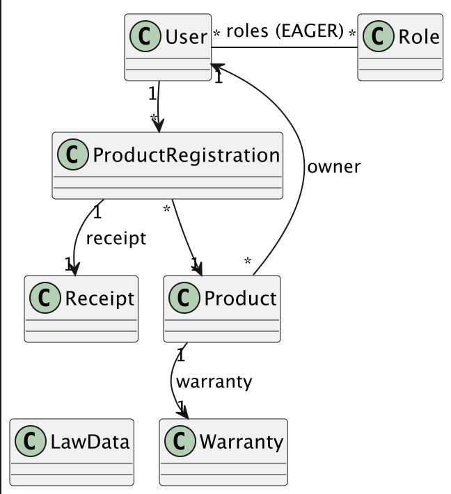
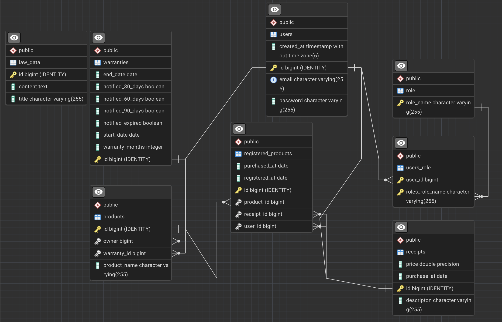

# Project Name

Warranty Project

## Vision

This project is a backend API for tracking products, receipts, product registrations, and warranties. The system includes JWT-based authentication/authorization and scheduled email reminders for upcoming warranty expirations.

---

## Links

Portfolio website:  
https://dannyshayh.github.io/Portfolio/

Project overview video (max 5 min):  
https://youtu.be/9xVua2tuYdw

Deployed application (optional):  
https://warrantyproject.greymansshop.dk/api/routes

Source code repository:  
https://github.com/DannyShayH/WarrantyProject

Implementation log (optional):  
https://dannyshayh.github.io/Portfolio/posts/warranty/

---

# Architecture

## System Overview

This project is built as a layered backend architecture using:

- Controller layer (Javalin REST endpoints in `app.controllers`)
- Service layer (business logic in `app.services.*`)
- DAO layer (database access in `app.daos`)
- Persistence layer (JPA entities in `app.entity`, Hibernate configuration in `app.config`)

Technologies used:

- Java 17
- Javalin 7.0.1 (REST API)
- Hibernate ORM + HikariCP 7.2.3.Final
- PostgreSQL 42.7.7
- JWT authentication (Nimbus JOSE + JWT) 9.0.1
- JBCrypt (password hashing) 0.4
- SendGrid (email reminders) 4.9.3
- JUnit 6.0.2 + Rest Assured 6.0.0 + Mockito (tests) 5.5.0

---

## Architecture Diagram

Client → Javalin Routes → Controller → Service → DAO → Hibernate (JPA) → PostgreSQL

Supporting components:

- JWT auth filter (runs on every matched route)
- Daily warranty reminder scheduler (SendGrid)
- XML fetch + extractor for Danish law text (persisted as `LawData`)

---

## Key Design Decisions

**Authentication and Authorization**

Authentication is implemented using JWT tokens. Users log in and receive a token which must be included in subsequent API requests as `Authorization: Bearer <token>`. Authorization is handled through route roles (`ANYONE`, `USER`, `ADMIN`) enforced in `beforeMatched` filters.

**Layered Structure**

Controllers are kept thin and delegate to services. Services handle validation, conversion between DTOs and entities, and orchestration. DAOs isolate Hibernate/JPA persistence concerns.

**Background Jobs (Warranty Notifications)**

On startup, a daily scheduler is started which checks warranty expiration dates and sends reminder emails (e.g. 90/60/30 days left and expired) through SendGrid.

**External XML Fetch and Persistence**

On startup, the app fetches Danish law text (XML) and persists extracted "garanti" content into the database (`LawData`). This keeps the application’s warranty guidance data queryable.

**Error Handling**

Validation errors for invalid path parameters and invalid/empty request bodies are translated into `400 Bad Request` responses by global exception handlers in the Javalin configuration.

---

# Data Model

## ERD

Domain model diagrams are available in `docs/`:

- `docs/domain_model1.png`
- `docs/Domain_model2.png`
- `docs/domain_model3.png`
- `docs/domain_model4.png`
- `docs/erd_diagram.png`

Example diagram:




---

## Important Entities

Brief overview of the main entities in the system.

### User

Represents a registered user in the system.

Fields:

- id
- email
- password
- roles
- createdAt

### Product

Represents a product owned by a user.

Fields:

- id
- name
- user (owner)

### Warranty

Represents a warranty attached to a product.

Fields:

- id
- warrantyPeriodMonths
- expirationDate
- product

### Receipt

Represents a purchase receipt attached to a product.

Fields:

- id
- purchaseDate
- description
- productRegistration

### ProductRegistration

Represents a product registration attached to a product.

### LawData

Represents extracted Danish law text content (XML-derived) persisted for querying/display.

---

# API Documentation

Base path: `/api`

Route overview (enabled in code):

- `GET /api/routes`

## Example Endpoints

### Create User (Register)

POST `/api/security/register`

Request body:

```json
{ "email": "me@example.com", "password": "12345678" }
```

Response:

- `201 Created`

---

### Login

POST `/api/security/login`

Request body:

```json
{ "email": "me@example.com", "password": "12345678" }
```

Response:

- `200 OK` (returns a JWT token)

---

### Get All Products (Protected)

GET `/api/product/all`

Headers:

- `Authorization: Bearer <token>`

Response:

- `200 OK`

---

### Get All Warranties (Protected)

GET `/api/warranty/all`

Headers:

- `Authorization: Bearer <token>`

Response:

- `200 OK`

---

### Healthcheck

GET `/api/security/healthcheck`

Response:

- `200 OK`

---

# User Stories

- As a user, I want to register an account so I can store my products, receipts and warranties.
- As a user, I want to log in and receive a token so I can securely access my data.
- As a user, I want to create and manage products so I can track what I own.
- As a user, I want to attach receipts to products so I can document purchases.
- As a user, I want to record warranty details so I can see when warranties expire.
- As a user, I want to receive reminder emails before a warranty expires so I can act in time.
- As an admin, I want to view and manage users so I can maintain the system.

---

# Development Notes

- Local (non-deployed) config is read from `src/main/resources/config.properties` (DB + JWT settings).
- Hibernate is configured to recreate the schema on startup (`hibernate.hbm2ddl.auto=create`).
- Startup runs a data populator and an external XML fetch/extraction step (requires internet access).
- IntelliJ HTTP client request files are available under `src/main/resources/http/`.
